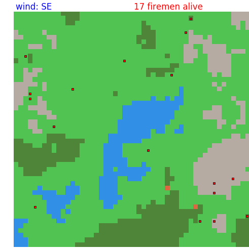

# S.I.E.R.R.A.
Simultation d'Incendies Expérimentale à Réalisation Rasterisée et Automatique

or

Simulating Ignition: an Especially Realistic Raster Application (name subject to changes)

Projet informatique IT1 de hdebray, azarz et Ogus.
Sujet n°4 : Simulation d'incendie

### Démonstration

